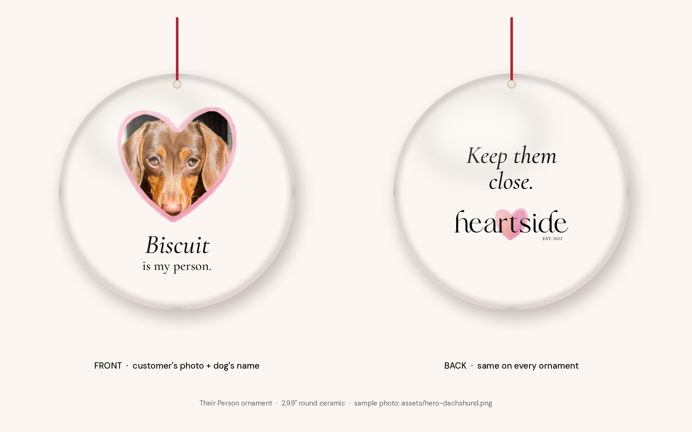
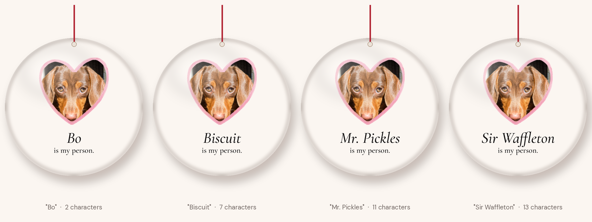

# The "Their Person" ornament: print files and Printify setup

The hero product from `docs/HANDOFF.md`. It's a round ceramic ornament. The front shows the customer's dog inside the Heartside watercolour heart, with "[Name] is my person." underneath. The back says "Keep them close." above the wordmark.



## Design decisions (and why)

- **The photo window is the brand heart itself.** I took the outline of `assets/heartside-heart-watercolor.png`, pulled it in by 24 px and cut the photo window from it, so a rim of real watercolour shows all the way round. It keeps the hand-painted wobble of the brand heart, which is what makes it read as hand-drawn rather than a heart icon. It also keeps to the "one heart at a time" rule.
- **The name sits on its own line, with "is my person." smaller underneath.** A name of any length then centres cleanly, and the sentence still reads as one thought. Names up to 13 characters fit at full size (see the test below). The character limit is set at 14.
- **Cream background, full bleed.** Brand cream `#FBF6F1` is close to the white of the glazed ceramic, so if the print lands a fraction off the edge, no white sliver shows.
- **Weights are one step heavier than on screen.** Cormorant Garamond Medium and Medium Italic, so the thin strokes survive printing at 3 inches. The wordmark on the back is 720 px wide on the file (about 1.4 inches). That keeps its letters clear. "EST. 2022" will print as a fine line.
- **No offer, date or year on the ornament.** It's a keepsake, so it shouldn't date. A year on the back ("Christmas 2026") is a common ornament convention and an easy add if you want it. It's one line in `tools/build_ornament.py`.



## Files

All print files are 1500 × 1500 px, square. That is about 500 px per inch on the 2.99" disc, well above Printify's 300 DPI. The circle fills the square edge to edge, and everything important sits inside a safe circle of 86% of the diameter (the blue line in `preview/*-with-guides.png`).

| File | What it is | Where it goes |
|---|---|---|
| `front-frame-overlay.png` | Cream disc and watercolour heart, with a transparent heart-shaped hole | Front, **top** image layer, stretched to fill the print area |
| `front-heart-window-mask.png` | White heart on black, full canvas: the photo window | Any editor with a mask or clip feature, and the fallback script |
| `front-heart-window-shape.png` | The same window as a transparent shape, cropped to its own size (715 × 681) | Tools that want a clipping shape |
| `front-sample-biscuit.png` | The finished front with the sample dog and "Biscuit" | Product images, the Shopify listing, and anywhere the editor needs real artwork to save |
| `back.png` | "Keep them close." and the wordmark | Back print area, fill |
| `preview/` | Product render, guides overlay and name-length test | For checking only. Don't upload these as print files |

To rebuild everything from the brand assets, run `python3 tools/build_ornament.py` (needs `pip install pillow`).

## Wiring it in Printify (about 20 minutes)

Printify doesn't publish this product's print-area pixels outside its Product Creator, so check the size it shows there. The files are square and proportional, so they scale to whatever it asks for.

1. **Create the product.** Ceramic Decoration Ornament, **Circle** shape. Pick a print provider that ships from the US.
2. **Front, frame.** Upload `front-frame-overlay.png` and scale it to fill the whole print area. Its edge should match the cut line.
3. **Front, photo (personalisable image).** Add an image layer. Use `assets/hero-dachshund.png` as the placeholder, which is also the default shoppers see. In Layers, move it **below** the frame. Centre it horizontally, with its centre **38%** from the top. Size it to about **50% of the print width**, so it covers the heart window with a little to spare. The window itself is 47.7% wide × 45.4% tall. Mark the layer **Personalizable → image**.
4. **Front, name (personalisable text).** Add text "Biscuit".
   - Font: Cormorant Garamond Medium Italic. If Printify doesn't list it, upload the TTF from `tools/fonts/`; it's free for commercial use under the SIL Open Font License.
   - Colour `#121010`, centred, with its centre **72%** from the top. Size it so "Biscuit" spans about **27%** of the print width.
   - Mark it **Personalizable → text**, max **14** characters, label "What's their name?".
5. **Front, second line (static text).** Add text "is my person.".
   - Same family in Medium (upright), `#121010`, centred, with its centre **81%** from the top. Size it to span about **29%** of the width.
   - Not personalisable. It's a separate text layer, rather than part of the frame image, so it always matches the name's font.
6. **Back.** Upload `back.png` and fill.
7. **Test before publishing.** In the live preview, try a portrait phone photo, the name "Sir Waffleton" (13 characters) and the name "Bo". All three should sit inside the safe area, like `preview/name-length-test.png`.
8. **Shopify.** Publish to Shopify and add the product to the **All gifts** collection, so the 30% and free shipping apply. Add Printify's **Personalize** app block to the product template in the Helio theme editor. Check which shipping profile the product lands in: General already has US Standard $5.99, so the free-shipping discount still covers it.

### If step 3 won't let the photo sit under the frame

Printify's documentation doesn't say whether a personalisable image can sit below a static layer. If it can't, keep the product but use **manual** personalisation. The buyer uploads a photo and types the name, the order arrives marked "Review needed", and you make the print file with one command:

```
python3 tools/build_ornament.py --photo their-dog.jpg --name "Biscuit"
```

That writes `ornament/orders/Biscuit.png` (the print file) and `Biscuit-check.png` (with the cut and safe circles drawn on). If the face sits off-centre, add `--focus 0.45,0.4` (x,y as fractions of the photo). Upload the print file as the order's front and approve it. It takes about two minutes per order. `ornament/orders/` is git-ignored, so customer photos never reach the repo.

## Two things in the handoff that need changing

**1. Personalised orders always wait for you.** The handoff says to turn on automatic sending "so no order needs Krish's hands." For this product that isn't possible as written. Printify flags every order containing a personalised product as **Review needed**, and it waits for your approval before production. Printify also warns Shopify sellers **not** to press "Request fulfillment" on these orders, because that overrides the personalisation settings and sends the order to production instantly without review. Printify has a timed auto-submit setting for orders; check in Settings whether it covers personalised ones. At launch volumes I'd keep the review step anyway. It takes 20 seconds, and it's the only point where a blurry photo or a typo gets caught before it's printed onto ceramic. If you keep it, it's also an honest line for the product page: "A person checks every photo before it prints."

**2. The price clears the floor, with a ceiling on cost.** At $34.99 list, the price after 30% off is $24.49. The floor rule (landed cost + 3% + $0.30 + $8) means landed cost (ornament + print + US shipping) can be at most **$15.45**. The base price starts around $4.90. Check that the double-sided print and the provider's first-item US shipping together stay under $15.45. If not, raise the list price rather than dropping the discount.

## Product page copy (draft)

These drafts follow the voice rules in `docs/BRIEF.md` section 1.

- **Title:** Their Person Ornament
- **Promise:** Their face and their name, on the tree every year.
- **Body:** A round ceramic ornament with your dog's photo inside our watercolour heart, and one line underneath: *[Name] is my person.* On the back, *Keep them close.* Upload a photo, add their name, and it goes to print with both.
- **Photo field:** "Their best photo." Help text: "Face close to the camera, in good light. We'll fit it into the heart. Buying for someone else? A clear photo from their Instagram works."
- **Name field:** "What's their name?" Placeholder "e.g. Biscuit". Up to 14 characters.
- **Fine print to confirm with the print provider before publishing:** size (2.99" round), ceramic with glossy finish, printed both sides, what it hangs from (ribbon or string), production time, and the order-by date for Christmas.

## Still open on this product

- **Licence for the hero dachshund photo.** It's the placeholder in the editor, on the sample front and on the social sharing image. Confirm it before any of those go public, or swap in a photo you own. Then rerun the two build scripts and every file updates.
- **The order-by date.** It equals Printify production time plus shipping, so get both from the chosen provider.
