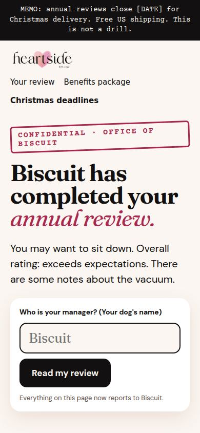
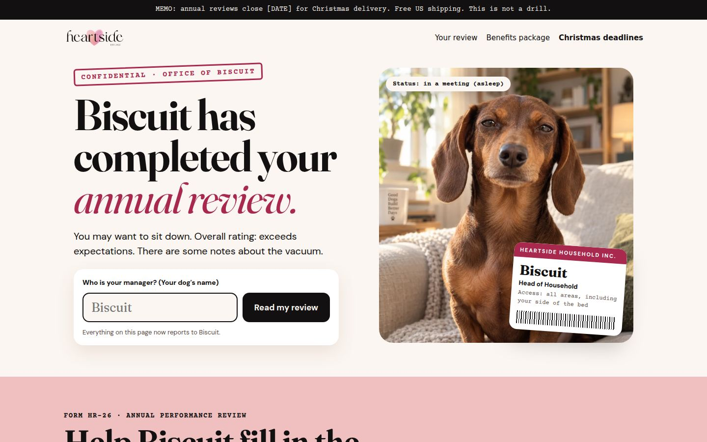

# Heartside v2 theme sections: "Your dog has notes"

The homepage and product templates, rebuilt from the approved canvas `design/Main.dc.html` as Online Store 2.0 sections for the Helio theme. The canvas copy is used word for word, checked by script against the source. They deploy through GitHub Actions into the **Heartside launch** theme (#197492998526) and nowhere else. Krish published it on 5 October, so it is the live theme: every deploy needs **allow_live_theme** ticked, and shoppers see it as soon as it lands.

| Phone | Desktop |
|---|---|
|  |  |

More in `preview/`:
- `phone-home-full.jpg` and `desktop-home-full.jpg`: the whole homepage.
- `review-builder-gerald.jpg`: the live poster and evidence photos after typing "Gerald".
- `leak-studio-gerald.jpg` and `story-cards.jpg`: the share section and its four free story cards.
- `product-annual-review.jpg`, `product-body-double-phone.jpg` and `product-teeinblue-bridge.jpg`: product pages, the last one showing answers copied into a stand-in Teeinblue form.
- `live-store-phone-sections.jpg` and `live-store-desktop-sections.jpg`: every section, one screen each, as the live preview renders them on 4 October (430 × 932 and 1440 × 900).
- `live-store-phone.jpg`, `live-store-desktop.jpg` and `live-store-leak.jpg`: as Shopify renders the Heartside launch preview (4 October, after the memo bar swap).

## How the page works

One shared state drives the whole page. The dog's name typed in the hero rewrites every mention: headline, stamp, ID badge, poster, memo, story cards, product copy and sticky button. The HR-26 answers drive the live poster, the evidence photos and the story cards. Everything is stored in `sessionStorage` for the visit and passed to product pages in the link.

- **Copy tokens.** In the theme editor, `{dog}`, `{DOG}`, `{dogs}` and `{person}` in any text setting become the shopper's dog and name. The page renders with Biscuit and Sarah until they type.
- **Joke lines.** The chip lines (improvement, incident, enemy) live in one place, `snippets/hs2-lines.liquid`, word for word from the canvas.
- **Evidence on file.** Under the live poster, three photos (Exhibit A, B, C) change with the chips: "The vacuum" shows the vacuum standoff, "Sharing food" the pug, "Your phone" the spaniel asleep on the laptop.
- **"Attach [Dog]'s headshot".** The photo goes onto the poster, the story cards and the phone preview at once. It stays on the shopper's device (IndexedDB, cleared after 3 days) until they use it on a product page.
- **Leak the review.** Four story cards, all drawn in the browser from the shopper's answers and photo at 1080 × 1920: the rating, the incident, the threat and the memo (the tender one). The phone preview is the exact card that downloads. Shoppers can save or share it, copy a caption, or send a link that opens the homepage on their dog's review (tagged `utm_source=leak`, with the card type as the campaign). Nothing is uploaded.
- **Answers carried to the product page.** "Approve [Dog]'s review", the leak section's poster button and the benefit links open the product with the answers in the link. The product page shows them in a "FORM HR-26 · ON FILE" card and adds them to the order as hidden line properties (`_Manager`, `_Employee`, `_Treat cupboard`, `_Improvement`, `_Incident`, `_Enemy`, `_Read-aloud video`).
- **Nobody types twice (the Teeinblue bridge).** On a product page, `hs2.js` copies the answers into Teeinblue's personalizer and offers a one-tap "Use [Dog]'s headshot". Details in **The Teeinblue bridge** below.

## One screen per section, motion, and honest urgency (4 October)

- **Fit.**
  - Every homepage section is exactly one screen tall, from 667px-tall phones to 1920 × 1080 desktops. This was measured at 360×740, 375×667, 390×844, 430×932, 768×1024, 1280×720, 1366×768, 1440×900 and 1920×1080.
  - Sections use `svh` units and type that scales with screen height. On phones the layouts change shape:
    - The review is five steps, one question per screen, with the poster scaled to fit and "Read it full size".
    - The benefits become a swipe carousel.
    - The FAQ shows as many tickets as fit, then "N more tickets".
  - Only phones 640px tall or less run 12px over, in two sections.
  - Helio pins its header row while the page scrolls (60px on phones, 66px on desktop). `hs2.js` measures it, so every section after the hero fits the room under it, and anchors stop below it.
- **Motion.**
  - The hero rises in, the stamp lands and the ID badge swings on its lanyard.
  - Sections reveal as they scroll in, and the management memo lands one paragraph at a time.
  - The policy and FAQ stamps land, and the closure and memo photos drift slowly.
  - The story cards play like a story until the shopper touches them.
  - Approve stamps APPROVED onto the poster before moving on, and the dog's name gets a marker swipe when it changes.
  - Everything stops for `prefers-reduced-motion`. Without JavaScript nothing hides.
- **Urgency, all from real dates.**
  - A countdown to Christmas morning shows in the memo ticker, the hero, the sticky bar, step 5, the sign-off and product pages, with a live clock over the Christmas room.
  - **HS memo bar > Last order date** (YYYY-MM-DD) switches every countdown to "N days left to order for Christmas" and labels each deadline row "N days left". Set it only once Printful confirms the date.
  - The free read-aloud video (V2 doc section 4) shows only from 20 October to 1 November. Both dates are memo bar settings. Preview another day with `?hs2_now=2026-10-25`.
  - Nothing invents stock or resets.
- **Plain words.** Each screen now says what you are buying:
  - The hero has a plain "what it is" line, which replaces the second joke line on phones.
  - Buttons read "Make my poster", "Approve and order [Dog]'s poster" and "Make [Dog]'s poster · $39".
  - Each benefits card has a product tag, and the leak section is labelled "FREE · FOR YOUR INSTAGRAM OR TIKTOK STORY".
- **Funnel events.** The theme publishes Shopify customer events for the funnel. Subscribe to them in Settings > Customer events (a custom pixel) to send them to GA4, Meta or TikTok:
  - `hs2_name_entered`, `hs2_review_step`, `hs2_approve_clicked`
  - `hs2_photo_attached`, `hs2_story_card`, `hs2_caption_copied`, `hs2_link_shared`
  - `hs2_faq_open`

## The ad landing page (Instagram and TikTok)

Paid traffic should land on the poster's product page in the `landing` layout rather than the homepage. The page has:
- No store menu.
- The hero and the five-step review.
- The buy box with Teeinblue on the same page.
- Proof, the memo, the deadlines and the FAQ.
- A sticky "Order [Dog]'s poster · $39".

Approve stamps the poster and scrolls to the buy box. Nothing opens a new page or a pop-up, so it converts inside Instagram's and TikTok's in-app browsers. There, the story card opens full size to press and hold, because those browsers can't download files.

The template is `templates/product.landing.json`. It needs no assigning: any product opens in it with `?view=landing`. Once the poster product exists, use these ad links (check the macro names in each ads manager):

- **Instagram / Facebook:** `https://heartside.io/products/<poster-handle>?view=landing&utm_source=instagram&utm_medium=paid_social&utm_campaign={{campaign.name}}&utm_content={{ad.name}}`
- **TikTok:** `https://heartside.io/products/<poster-handle>?view=landing&utm_source=tiktok&utm_medium=paid_social&utm_campaign=__CAMPAIGN_NAME__&utm_content=__CID_NAME__`

Add Teeinblue's app block to the landing template too (`docs/SHOPIFY-BROWSER-PROMPT.md` task 5).

## The Teeinblue bridge

Teeinblue has no documented prefill feature, so this was built against its storefront code, read and tested on Teeinblue's own demo store on 4 October 2026.

- **What it does.**
  - It finds each Teeinblue field by its heading and fills it the way typing does. Dropdowns and Teeinblue's picture choices are matched by the chip label or the full printed line. For picture choices it clicks the label, because Teeinblue ignores a ticked input and keeps its own pick (marked `active`), which is what prints; found on the live store on 5 October, where the poster would have printed Teeinblue's first option.
  - It then checks Teeinblue's own record (`window.teeinblue.getCurrentCustomization()`).
  - If a value didn't take, it writes Teeinblue's saved customization and asks it to reload (`refillCustomizationData`), which is Teeinblue's own restore path.
- **The headshot.** One tap on "Use [Dog]'s headshot" hands the review's photo to Teeinblue's upload field. Teeinblue then opens its cropper and uploads as if the shopper had picked the file. It needs the tap, so nothing uploads without the shopper.
  - The button shows until that photo has gone to that product (remembered per product in the browser), even when Teeinblue restored an older upload from an earlier visit.
  - On 5 October the landing page lost the button because Teeinblue had restored an upload. The cropper now sits above Helio's sticky header.
- **Respecting the shopper.**
  - It never overwrites a field the shopper has edited.
  - Edits made in Teeinblue flow back into the answers card and the order's hidden properties, so the answers are always the source.
  - **Every visit** (since 5 October evening). It compares the answers with what Teeinblue holds and copies over any difference. It used to copy once per product per session, and on a second visit Teeinblue's own first picks stayed.
  - **Focus and scroll stay put.** A scripted click on a label moves focus to its radio, and the browser scrolls to it. On the ad landing page, that pulled a shopper typing in the hero 5,000px down the page. The bridge now puts focus and scroll back after each click.
- **The fold.** Once every field the review fills holds its answer, Teeinblue's copies of them hide, and the card offers **Edit details**. The page reads: preview, price, answers, photo, Add To Cart. The photo field, and any field the review doesn't fill (the ornament's note, for one), stay open. The fold opens again, and never closes on its own, when:
  - the shopper edits a Teeinblue field;
  - a name is missing;
  - Teeinblue marks a field invalid at Add To Cart.

  The fields are hidden by id, which Teeinblue keeps when it redraws a field.
  - **On the ad landing page** the review sits above the buy box, so the fields it answers fold from the start, filled or not. A missing name is asked for in the review, and Teeinblue's own check at Add To Cart opens the fold.
  - **Teeinblue's photo box** waits behind "Use [Dog]'s headshot" while the review holds a photo that hasn't gone to this product yet. It comes back once the photo is handed over.
- **Proof.**
  - On Teeinblue's live demo store, the bridge filled the name field, Teeinblue's record and preview updated, and the hand-off opened Teeinblue's cropper and uploaded the photo.
  - `tools/preview/shots.mjs` repeats the whole flow against a stand-in built with Teeinblue's markup and the six field labels.
- **What it depends on.**
  - **The field labels** in `docs/TEEINBLUE-SETUP.md`. A heading must contain "manager" or "dog's name" (either apostrophe), "employee" or "your name", "cupboard", "improvement", "incident" and "enemy". The plain labels Krish asked for ("Your dog's name", "Your name"; `docs/COWORK-PROMPT-2026-10-06.md`) match. A new field's label must avoid those words, or the bridge writes into it.
  - **Teeinblue's markup:** `.tee-field`, `.tee-field__heading`, and `input[type=file]` for photos.
  - If Teeinblue changes either, the answers card still shows the answers, and the order still carries them as hidden properties.
- **Placeholders never travel.** "Biscuit" and "Sarah" only fill the page until the shopper types. The approve link, the order's hidden answers and the bridge carry real answers only, so a poster can't print a stranger's name. Approve without both names goes back to step 1 with "HR needs your name for the file." (or the manager's name, or both), and opens a dog-name field there if the hero was skipped. The treat count (1,412) and the chips keep their defaults, because they print sensibly.
- **Where Teeinblue draws.** The product section tells Teeinblue to put its live preview at the top of the media column (`[data-hs2-tib-gallery]`). When Teeinblue's preview appears, the theme's own live poster hides, so there is one preview.

## The product page with Teeinblue's block (5 October)

- **One add to cart.** With Teeinblue's app block on the page, the theme's button and variant select step aside and Teeinblue's "Add To Cart" is the only one. It is the only button that attaches the print file: on 5 October the theme's button posted the form straight to the cart with no personalization. The theme's form stays, hidden, with the order's hidden answers.
- **One price.** The block's "Show price" is off in the templates, so the theme's price shows. It follows Teeinblue's picker through the `?variant=` Teeinblue writes to the address.
- **A clean picker.** "Show available product options" is off. Options with one value hide (CSS). The section setting **Plain names for product options** renames the rest in Teeinblue's picker and in the theme's own: the review and landing templates use `Color: Frame | Size: Size`, so the framed poster asks for a **Frame** (Black, Red Oak, White) and the poster shows no picker. Teeinblue's title is its own option key ("color", set in its block from the product base, not the Shopify option name), so renaming the option in admin wouldn't change it. `hs2.js` swaps the title's text and swaps it back whenever Teeinblue redraws the picker. (Until 5 October this was a CSS swap, which the phone test showed losing to Teeinblue's own styles.)
- **"Want it framed? $89".** An **Upsell link** block under the Add To Cart on the poster's templates points to the framed poster, with its price and a line of facts. It's a link, styled quietly so it never competes with Add To Cart, carries the answers, and hides on the framed page itself.
- **Descriptions.** Teeinblue rewrites the product description with Printful's text on every campaign update, so each **Description** block names a product and holds our copy for it. The block for this product wins, then a block with no product, then the product's own description.
- **One picture at a time.** Teeinblue's live preview is the picture on show, and the product photos are thumbnails behind it. The first thumbnail, "Yours", brings the preview back. Teeinblue's inline gallery height is overridden: on a desktop browser it equals the form's height (1,557px on a narrow window), which left a blank gap under the preview. Teeinblue's copy of Printful's description is hidden, because the section shows ours.
- **Express checkout.** It stays in the cart (Shop Pay, PayPal and Google Pay showed there on 5 October, and Apple Pay shows in Safari), not on the product page. A product-page express button would skip Teeinblue's Add To Cart, and that button is the only one that attaches the print file.
- **The cart** (Helio's drawer and page, tidied by `hs2.js`, which loads on every page with the memo bar):
  - The framed poster reads "Frame: Red Oak".
  - "Available Product" and options that aren't a choice ("Default", "1 pc") are left out.
  - The picture is the shopper's own preview (Teeinblue's `_customization_image`, read from `/cart.js`).
  - The tax note reads "Free US shipping. Taxes calculated at checkout." It keeps the tax half, so the total is never implied tax-free.
- **Links.** The homepage's poster links open `?view=review` and the benefits cards `?view=heartside`, so the flow works before the templates are assigned in admin, and still works after.

## Product photos (5 October)

`design/mockups/` holds product photos with the real print in them. The scenes (`assets/v2/scenes/`) were generated in ChatGPT with every product surface left blank, and `tools/preview/mockups.py` places the real file on each one, in the scene's own light, with fingers and ribbons kept in front. The product itself is never AI-drawn, because image models redraw text. The dog is Biscuit (`assets/v2/biscuit-headshot.jpg`), generated for Heartside, so the photos carry no licence question.

| File | Product | Use |
|---|---|---|
| `office-black-b`, `office-black-a` | Framed, black | Product image 1, ads |
| `entry-oak-a`, `entry-oak-b` | Framed, red oak | Product image 2, ads |
| `christmas-sheet-a`, `christmas-sheet-b` | Poster, unframed | Product image 1, holiday ads |
| `ornament-tree` | Tiny Me | The HS ornament section, once it's switched on. **Not in use yet.** On 5 October the face was rebuilt to Teeinblue's artwork as the admin run described it (double red ring, red verdict from top right, clockwise, smaller photo with no outline, black Fraunces name). It stays off the homepage card and the product until it's matched against `teeinblue-ornament-preview.png` and a fresh Teeinblue preview |
| `pillow-sofa-a` (`pillow-sofa-b` spare) | The Body Double | Product image 1, the homepage card. The print is the headshot itself, edge to edge, as the Body Double prints a customer's photo. The pillow's outline is traced once and kept as `assets/v2/scenes/pillow-sofa-a.mask.png` |

Each comes full size, plus a `-4x5` crop (product pages, feed ads; portrait scenes only) and a `-1x1` crop (cards). Crops start just above the product and never cut it. Rebuild with `node tools/preview/print.mjs` (the poster and ornament faces with Biscuit) then `python3 tools/preview/mockups.py`.

## The store's order (5 October)

The review is the hook and the ornament is what people keep, so the homepage runs: the review builder (the $39 poster), then Tiny Me ($24), then the Body Double ($59). The framed poster is an upsell on the poster's page only. Every part of the order is a setting, so it can flip back without code:

- **HS ornament** (after the review builder): Tiny Me's own section. **Show this section** is off until its photo is checked; when it goes on, also hide the Tiny Me card in the benefits section.
- **Length** (5 October evening, Krish: the long scroll tires quick buyers).
  - **Homepage:** hero, review, (Tiny Me, hidden), more gifts, questions with our promises, the story card, sign-off.
  - **Ad landing page:** hero, review, buy box, questions with our promises, sign-off with the Christmas line under its button.
  - **Product pages:** the buy box, then questions.
  - The management memo, the holiday closure and company policy are out of every template. Their sections stay in the theme.
  - The Christmas order date moves to the memo bar, which shows it only once **Last order date for Christmas** is set (`[DATE]` in the memo becomes that date). Until then it reads "Free US shipping on every order." with the Christmas countdown.
- **HS more gifts** (was "benefits package"): each card has **Position** (1 shows first) and **Hide this card**. Tiny Me is 1, the Body Double 2; the Uniform and Socks are hidden.
- **The read-aloud video**: the review builder's **Show the read-aloud video button** is off. Nothing sells or makes the video yet: there's no product for it, Teeinblue's Add To Cart doesn't carry the request, and no process records and emails it. With the button off, no page mentions the video or its "Free until November 1" offer, and its Christmas Eve deadline row is hidden.

## Funnel pixel (Meta and TikTok)

`shopify/pixels/hs2-funnel.js` is a Shopify custom pixel. It forwards the theme's funnel events to Meta and TikTok as custom events: `hs2_name_entered`, `hs2_review_step` (with the step), `hs2_names_needed`, `hs2_approve_clicked`, `hs2_photo_attached`, `hs2_story_card`, `hs2_caption_copied`, `hs2_link_shared` and `hs2_faq_open`. Approving is also sent as the standard event `CustomizeProduct`, which both platforms can optimize for straight away. Page views, add to cart, checkout and purchase come from Shopify's Facebook & Instagram channel (and TikTok's, if installed); this pixel doesn't send them again. Names never leave the store: only the step, card, question and which name was missing.

To install it:
1. Copy the Meta pixel (dataset) ID from Meta Events Manager and, if TikTok ads will run, the pixel ID from TikTok Events Manager. Paste them into `META_PIXEL_ID` and `TIKTOK_PIXEL_ID` at the top of the file. Either can stay empty; with both empty the pixel does nothing.
2. Shopify admin > **Settings > Customer events > Add custom pixel**, named "Heartside funnel".
3. **Customer privacy:** Permission "Required: marketing", Data sale "Data collected qualifies as data sale".
4. Paste the whole file into the code box, **Save**, then **Connect**.
5. Test it: open the store, type a dog's name, step through the review. Meta Events Manager > Test events and TikTok's Pixel Helper should show the `hs2_` events. Customer events also has a **Test** button that logs each event.

The workflow never pushes this file (`--ignore "pixels/*"`); it lives in the repo so it is versioned.
- **Check once templates exist.** Open a product from the homepage after answering, and confirm that the fields fill, the headshot button works, and Teeinblue's preview sits in the media column. If the preview lands somewhere else, set the gallery selector to `[data-hs2-tib-gallery]` in Teeinblue's theme settings.

## Files

| Section | Canvas part |
|---|---|
| `hs2-memo` | Memo bar. It belongs in the **header group**, above Helio's header. |
| `hs2-hero` | "[Dog] has completed your annual review.", name card, ID badge, status pill, the manager photo |
| `hs2-review` | Form HR-26 builder with chips, the live poster, evidence photos, price box and read-aloud toggle |
| `hs2-management` | "A word from management", the tender memo, with the dog asleep under a hand |
| `hs2-benefits` | Benefits package cards, with item codes and `[… SHOT]` placeholders |
| `hs2-closure` | Notice of holiday office closure (`[DATE]` placeholders), over the Christmas living room |
| `hs2-policy` | Company policy, three promises |
| `hs2-leak` | "Leak [Dog]'s review.": the phone preview, four story cards, caption, link and the poster button |
| `hs2-faq` | The HR help desk: "HR is in a meeting (asleep)", nine tickets, the contact email, a closing button, and FAQ structured data |
| `hs2-signoff` | "Heartside · Keep them close · heartside.io", set as a signed lockup |
| `hs2-sticky` | "Read [Dog]'s review · $39" pill, shown once the hero has scrolled away |
| `hs2-product` | Product page: gallery or live poster, stamp, title, price, description, answers on file with the headshot button, Teeinblue app block slot, add to cart, policy lines |

- **Templates:**
  - `index.json` (the homepage).
  - `product.review.json` for the two Annual Review products; it shows the live poster.
  - `product.heartside.json` for the Body Double and Tiny Me (and the Uniform and Socks when they return).
- **Snippets:**
  - `hs2-head`: fonts, CSS and JS.
  - `hs2-t`: tokens.
  - `hs2-lines`: joke lines.
  - `hs2-poster`: the live poster.
  - `hs2-photos`: photo addresses for the script.
  - `hs2-paw`.
- **Assets:**
  - `hs2.css` and `hs2.js`.
  - Fraunces, DM Sans and Courier Prime, self-hosted and subset (about 160 KB in total).
  - The photos from `assets/v2/`, as WebP at two sizes, built by `tools/build_shopify_assets.py`.

## New copy for Krish to approve

Added on 5 October evening (live, except the hero):
- **The hero, version B (not live; Krish decides on `design/hero-2026-10-05/`).**
  - Eyebrow: "PERSONALIZED POSTER · $39 · FREE US SHIPPING"
  - Headline: "Your dog loves you too. Now it's *in writing.*" Once a name is typed it becomes "Moose loves you too…".
  - Subline: "Their annual review of you, printed on a 12 × 18 inch poster with their photo and your name."
  - Name field: "Your dog's name"
  - Proof line: "A person checks every order · Misprinted? We make it right · Free US shipping"
  - Version A (fallback for colder traffic): "Your dog wrote your *annual review.*" / "They love you too, and they'd like it on the record. A 12 × 18 inch poster with their photo, your name and three notes you pick."
  - The renders live in `tools/preview/render.mjs` (`HERO_B`, `HERO_A`).
- **Review step 1:** labels "Your dog's name" and "Your name".
  - The nudges: "Add your name. It goes on the poster." / "Add your dog's name. It goes on the poster." / "Add both names. They go on the poster."
  - New: "[Dog] has picked the rest. Skip to the photo".
  - The attach box after a photo: "Headshot attached · change".
- **Product page.** The answers card: "YOUR ANSWERS", "From [Dog] to [Name]", the picks in one line, "Copied into the preview.", "Edit details" / "Hide details". Its note: "If the personalizer below asks for these, use them." The headshot status: "Headshot sent to the personalizer. Crop it there and press Select." Policy line 2: "Misprinted or damaged? Full refund or a free remake."
- **Questions** (was "HR FAQs"), with our promises:
  - "A person checks every order before it prints." (detail: "If the photo won't print well, we tell you first.")
  - "Misprinted or damaged? Full refund or a free remake." ("Email a photo within 30 days of delivery.")
  - "Every review gets published, good or bad." ("We're new, so there are none yet.")
  - The contact line: "Anything else: krish@heartside.io".
  - Rewritten answers:
    - "What if something is wrong with it?": "Email a photo of the problem to krish@heartside.io within 30 days of delivery. If it arrived misprinted, damaged or wrong, you get a full refund or a free remake, your choice. Each one is made for you, so we can't take returns for a change of mind."
    - "When will it arrive?": "…Once our maker confirms this year's last order date for Christmas, it goes in the bar at the top of the page."
    - "What happens to my dog's photo?": "…When you add it in the personalizer, it goes to our print partner so they can make your order."
- **More gifts** (was "Benefits package"): eyebrow "MADE FROM THE SAME PHOTO", heading "More of [Dog], for the tree and the sofa.", line "You both had a big year. Free US shipping on every one."
  - The cards, in the dog's voice. Tiny Me ("Ceramic ornament · 3 in"): "Me, on a ceramic ornament, with a little note to you around the edge. We both had a good year. This one is for the tree." The Body Double ("Photo pillow · 16 in square"): "My face, on both sides of a 16-inch pillow. For when I can't be on the sofa with you."
  - The item codes and the "[ORNAMENT SHOT]" tag are gone from the cards.
- **The Body Double's description:** "[Dog]'s face on a 16-inch pillow, printed on both sides. For when [Dog] can't be on the sofa with you: groomer days, vet days, work trips." Both sides is confirmed: Teeinblue campaign 1032878 maps the artwork to front and back.
- **Memo bar:** "Order by [DATE] for Christmas delivery. Free US shipping." once the date is set. Until then: "Free US shipping on every order."
- **Sticky bar:** "Make my poster · $39".
- **Renamed sections:** "Our promises", "Christmas order dates", "HS questions", "HS more gifts".

Added on 5 October, second run (all live on the preview theme except where marked):
- **Printful-true fixes.** Framed: "…in a black, red oak or white wood frame with an acrylic front, hanging hardware included." Pillow: "A 16-inch pillow printed with [Dog]'s face. … / Square, printed edge to edge, with a shape-retaining insert included." The pillow no longer says "on both sides" (product page and card) until Krish confirms it in Printful.
- **The poster's job.** Review builder: "…It prints as a poster for the fridge, the office or the wall by [Dog]'s bed, or for someone whose dog is clearly their manager." Poster description: "[Dog]'s review of your year, printed for the fridge, the office or the wall by [Dog]'s bed: …" One price on the homepage: the buy box reads "$39 12 × 18 poster" and the leak section "$39 poster · Free US shipping".
- **Holiday closure, "Missed it?":** "Missed it? The story card is free and instant, so [Dog] still has something to say on Christmas morning. The poster follows." (It used to promise an email of the review that nothing sends.)
- **Upsell link:** "Want it framed? $89" with "Black, red oak or white wood, acrylic front, hanging hardware included."
- **HS ornament** (hidden until its photo is checked): eyebrow "ITEM TM-04 · FOR THE TREE"; heading "[Dog], for the tree."; text "[Dog]'s face on a ceramic ornament, with the verdict on your year printed in a ring around it and [Dog]'s name underneath. It comes out every December. The verdict does not change."; the ring word for word; button "Hang [Dog] on the tree · $24"; facts "Ceramic, 2.99 inches across, printed the same on both sides. Made after you order and checked by a person. Free US shipping."
- **Christmas line for the ornament, pick one (none is live; the setting is empty):**
  1. "Filed for the tree. Reviewed every December. The rating has not changed."
  2. "[Dog] has approved a seasonal placement on the tree. Renewed every December, for life."
  3. "Tiny Me reports to the tree each December. HR has no further notes."

Added on 5 October, first run:
- **The name nudge** (review step 1, shown when Approve is pressed without a name): "HR needs your name for the file.", "HR needs your manager's name for the file." and "HR needs both names for the file."
- **Product descriptions** (Description blocks in the product templates). The facts in them (paper, frame, insert, size) are to check against Printful before launch.
  - **The Annual Review:** "[Dog]'s review of your year, printed for the wall: your name, [Dog]'s headshot and the three notes you picked, on a 12 × 18 inch poster of thick matte paper. / Frame not included. [Dog] has requested one in next year's budget. Made after you order, and a person checks it before it prints. Free US shipping."
  - **The Annual Review, Framed:** "The same review, framed and ready to hang. [Dog] felt the paperwork deserved it. / A 12 × 18 inch poster on thick matte paper, in a black, red oak or white wood frame, with the hanging hardware already on. Made after you order, and a person checks it before it prints. Free US shipping."
  - **The Body Double:** "A 16-inch pillow with [Dog]'s face on both sides. For groomer days, vet days, and the occasional covert operation to the kitchen. / Square, printed edge to edge, insert included. Made after you order, and a person checks it before it prints. Free US shipping."
  - **Tiny Me, For The Tree:** "[Dog], about three inches across, for the tree. The verdict runs in a ring around the photo: Overall rating: exceeds expectations. Contract renewed. For life. [Dog]'s name sits underneath. / Ceramic, with the same design on both sides, so it faces the room whichever way it turns. Made after you order, and a person checks it before it prints. Free US shipping."
- **Benefits cards:** the Body Double tag "Square photo pillow · 16 in" with "A 16-inch pillow with [Dog]'s face on both sides. For groomer days, vet days, and the occasional covert operation to the kitchen." Tiny Me: "A ceramic ornament of [Dog], with [Dog]'s verdict on your year printed in a ring around the photo."
- **Deadline row:** "Review poster and ornament" (was "Review poster, socks, ornament").

Added on 4 October to make the page read like a shop:
- **Hero:** "A personalized 12 × 18 inch poster of your dog's review of you, with their photo and your name. $39, free US shipping." The button reads "Make my poster".
- **Review:** "FORM HR-26 · 5 QUICK QUESTIONS · TAKES A MINUTE". The steps add "STEP 1 OF 5", "PRINTS AS", "Back" and "Next", and the button reads "Approve and order [Dog]'s poster".
- **Benefits:** "More gifts made from your dog's photo. Free US shipping on every one." The product tags are "Square photo pillow · 16 in" and "Two-sided ceramic photo ornament". The Uniform and Socks cards are hidden for launch with each card's "Hide this card" setting; their copy stays in the template for when they return.
- **Leak:** the eyebrow reads "FREE · FOR YOUR INSTAGRAM OR TIKTOK STORY".
- **Buttons:** the sticky bar, sign-off and FAQ buttons read "Make [Dog]'s poster · $39" ("Order [Dog]'s poster · $39" on the ad landing page).
- **Countdowns:** "Christmas morning in N days", or "N days left to order for Christmas" once a date is set. The offer line reads "Free until November 1".

Earlier additions:

The canvas copy is untouched. These lines are new, written to the comedy bible (`docs/V2-FROM-THE-DOG.md` section 2). Each is a theme-editor setting, so any of them can be changed or deleted there.

- **Leak section:**
  - "FOR INTERNAL DISTRIBUTION ONLY" and "Pick the leak".
  - The card names: The rating, The incident, The threat, The memo.
  - The buttons "Copy the caption" and "Send the link".
  - "The card uses a stand-in dog until you attach [Dog]'s headshot. Attach it in the review"
  - "The full review, on paper." and "$39 poster · $89 framed · Free US shipping".
  - The story cards reuse canvas lines only.
- **HR help desk:**
  - "HR is in a meeting (asleep)" and "SELF-SERVICE DESK".
  - "HR is asleep, so the answers are filed here. Anything [Dog] can't answer goes to a person."
  - "Still deciding? [Dog] has already decided."
- **Five new FAQ tickets** after the canvas's four:
  - "When will it arrive?"
  - "Can I see it before it prints?"
  - "What if it arrives damaged or misprinted?"
  - "What happens to my dog's photo?"
  - "Who do I complain to?" ("[Dog]. Response times vary. …")
- **Product page:**
  - "Use [Dog]'s headshot"
  - The status lines "Copied into the personalizer below. Change anything you like there." and "Headshot sent to the personalizer. Crop it there."
- **Evidence labels:** "EVIDENCE ON FILE" and "EXHIBIT A/B/C".

## Deploy

On github.com/krishanraja/heartside: **Actions > Push homepage to a Shopify theme > Run workflow**, branch `main`, `theme_id` **197492998526**. The workflow refuses any theme not named "Heartside launch", and refuses the live theme unless **allow_live_theme** is ticked for that run. Since 5 October Heartside launch is live, so tick it.

- **Files.** It only adds and updates files (`--nodelete`). The v1 ornament sections and snippets therefore stay in the theme, unused. Delete them in the code editor if they clutter the "Add section" list.
- **Backup and the editor-edit guard.** Before every push it saves the theme's templates, section groups, `settings_data.json` and the hs2 section files as a run artifact (`theme-backup-…`, kept 30 days). `.github/scripts/editor-edits.mjs` then compares each template with every committed version, ignoring settings the editor writes out at their default. If a template has theme-editor changes the repo doesn't, the push **stops**, because pushing `templates/*.json` replaces them. Copy those settings into `shopify/templates/` from the artifact, or rerun with **overwrite_editor_edits** to discard them. Tick **pull_only** to save the artifact without pushing anything. The footer group and `settings_data.json` (app embeds) are never pushed.
- **Header.** Tick **header_memo_bar** to put the HS memo bar at the top of the header group and remove the v1 offer bar ("30% off and free US shipping until November 1."). Any other announcement bar is hidden, not deleted. The script is `.github/scripts/header-memo.mjs`.

## After deploying, in the theme editor (Heartside launch > Customize)

1. **Header layout:** Helio lays its header over the hero on the homepage. `hs2.js` pads the hero by the overlap, so nothing collides. The cleaner fix is to turn off the transparent or overlay header in Helio's header settings, which gives the logo its own row (`docs/V2-FROM-THE-DOG.md` section 7). Point the main menu at `#review` "Your review", `#benefits` "More gifts" and `#faq` "Questions". `#closure` is off the homepage since 5 October evening.
2. **Product pickers and Teeinblue:** done in the repo since 5 October (the review builder, leak section and benefits cards point at their products; Teeinblue's block sits in all three product templates). One step is left for after Krish publishes: assign the product templates (Products > each product > Theme template), **review** for the poster and framed poster, **heartside** for the rest. The homepage links already open those templates with `?view=`, so nothing breaks before then.
3. **Placeholders:** replace `[DATE]` and `[… SHOT]` only when the real date or image exists (see below).

## Placeholders left in place

| Where | Placeholder | Replace with |
|---|---|---|
| HS memo bar | **Last order date for Christmas** (empty) | The confirmed date as YYYY-MM-DD. `[DATE]` in the memo becomes it, and the bar never shows `[DATE]` before then. Printful's 2026 guide is dated November 2025 (11 Dec standard for US-fulfilled home and living), so recheck it in early November and get Krish's yes |
| HS Christmas order dates | `[DATE]` × 3 | Off every page since 5 October evening. Fill it only if the section comes back |
| HS more gifts | Tiny Me's card shows a stand-in photo (no tag) | The ornament photo, rebuilt from Teeinblue's real output once the note picker is live (`docs/COWORK-PROMPT-2026-10-06.md` task 5). Then switch on the HS ornament section and hide the card |
| HS product (both templates) | `[PRODUCT SHOT]` | Shows only when a product has no images; disappears once Printful mockups are on the product |

## Checks run

- **Shopify Theme Check:** 0 offenses across all sections, snippets and templates.
- **Rendered locally** with liquidjs and screenshotted in Chromium at 390 px and 1440 px. No horizontal overflow and no script errors.
- **Interaction test (`tools/preview/shots.mjs`):**
  - Typing a name rewrites the headline, stamp, badge, poster, memo and buttons.
  - The chips change the poster lines and the evidence photos, and the read-aloud toggle relabels.
  - An attached headshot reaches the poster and hides the stand-in note.
  - All four story cards download. The phone tap zones cycle the cards, and the caption and link copy to the clipboard.
  - The approve link carries every answer, and the product page shows them and fills the order properties.
  - On the stand-in Teeinblue form, all six fields fill, the headshot reaches Teeinblue's upload, and an edit in Teeinblue updates the order property.
  - The sticky pill hides over the builder and the help desk's closing button.
  - The 5 October bugs, each with its own `BUG n` line: Approve with no names stays on step 1 with the nudge and never carries "Sarah" (link, hidden answers, Teeinblue); a chip then Next lands on the next step and stays there; the framed poster shows one price, a "Frame" picker and one add to cart, and its price and variant follow the picker; the poster shows no picker; without Teeinblue the theme's own picker reads "Frame: Black, Red Oak, White"; each product shows its own description, and Printful's when none is written.
- **Teeinblue's real code:** the bridge and the headshot hand-off ran against Teeinblue's live demo store (see above).
- **Copy:** every visible string in `design/Main.dc.html` is present word for word. The only changes are the alt texts of the old stand-in photos, which now describe the real photos.
- **On the real store:** after each deploy the Heartside launch preview (`?preview_theme_id=197492998526`) is loaded in Chromium at 390 px and 1440 px.
- **Shopify's Liquid tokenizer:** Shopify ends an output tag at the first closing brace, which the local tools don't. `tools/preview/render.mjs` fails on that pattern before anything ships, and the workflow fails if Shopify rejects any file.

Rebuild and recheck: `python3 tools/build_shopify_assets.py`, then `cd tools/preview && npm install && node render.mjs && node shots.mjs`. Print files: `node print.mjs`.
