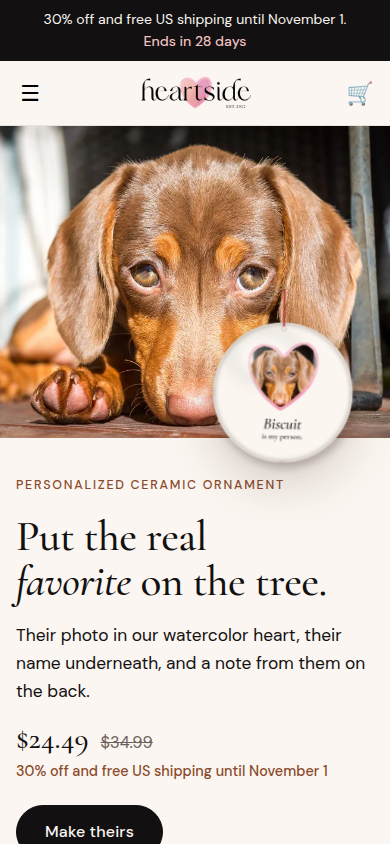
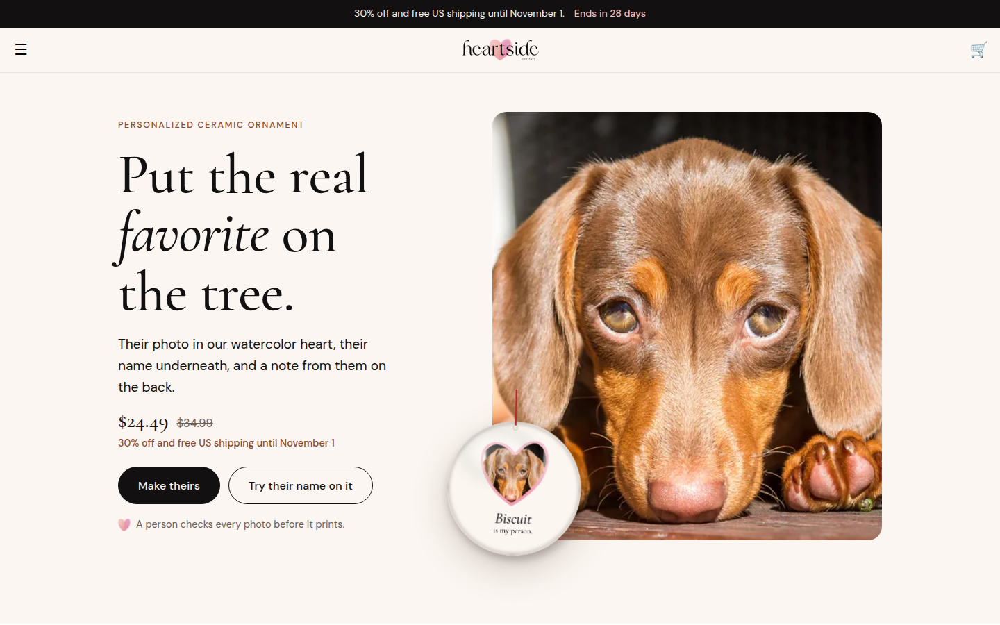

# Heartside v2 theme sections: "Your dog has notes"

The homepage and product templates, rebuilt from the approved canvas `design/Main.dc.html` as Online Store 2.0 sections for the Helio theme. All the copy is the canvas copy, word for word, checked by script against the source (157 strings). They deploy through GitHub Actions into the unpublished **Heartside launch** theme (#197492998526) and nowhere else. Krish publishes.

| Phone | Desktop |
|---|---|
|  |  |

Full pages are in `preview/`: `phone-home-full.png`, `desktop-home-full.png`, `product-annual-review.png`, `product-body-double-phone.png`. `review-builder-gerald.png` shows the live poster after typing "Gerald". `story-card.png` is the free 1080 × 1920 card the share button makes.

## How the page works

One shared state drives the whole page. The dog's name typed in the hero rewrites every mention: headline, stamp, ID badge, poster, memo, product copy and sticky button. The HR-26 answers drive the live poster. Everything is stored in `sessionStorage` for the visit and passed to product pages in the link.

- **Copy tokens.** In the theme editor, `{dog}`, `{DOG}`, `{dogs}` and `{person}` in any text setting become the shopper's dog and name. The page renders with Biscuit and Sarah until they type.
- **Joke lines.** The chip lines (improvement, incident, enemy) live in one place, `snippets/hs2-lines.liquid`, word for word from the canvas.
- **Answers carried to the product page.** "Approve [Dog]'s review" and the benefit links open the product with the answers in the link. The product page shows them in a "FORM HR-26 · ON FILE" card, adds them to the order as hidden line properties (`_Manager`, `_Employee`, `_Treat cupboard`, `_Improvement`, `_Incident`, `_Enemy`, `_Read-aloud video`), and tries to fill matching Teeinblue fields.
- **Teeinblue prefill is not guaranteed.** Teeinblue documents no prefill API, so the fill is best effort: it matches field labels and only fills empty fields. Until it's tested on the live theme with real templates, assume shoppers may type the answers again in Teeinblue. The "on file" card tells them what to use.
- **"Attach [Dog]'s headshot".** On the homepage this previews the shopper's photo on the poster. The photo stays on their device; the real upload happens in Teeinblue on the product page.
- **"Get the free story card".** Draws a 1080 × 1920 PNG from the answers in the browser. It opens the share sheet on phones and downloads on desktop. Nothing is uploaded.

## Files

| Section | Canvas part |
|---|---|
| `hs2-memo` | Memo bar. It belongs in the **header group**, above Helio's header. |
| `hs2-hero` | "[Dog] has completed your annual review.", name card, ID badge, status pill |
| `hs2-review` | Form HR-26 builder with chips, the live poster, price box and read-aloud toggle |
| `hs2-management` | "A word from management", the tender memo |
| `hs2-benefits` | Benefits package cards, with item codes and `[… SHOT]` placeholders |
| `hs2-closure` | Notice of holiday office closure (`[DATE]` placeholders) |
| `hs2-policy` | Company policy, three promises |
| `hs2-leak` | "Leak [Dog]'s review.", the story card |
| `hs2-faq` | HR FAQs, with FAQ structured data |
| `hs2-signoff` | "Heartside · Keep them close · heartside.io" |
| `hs2-sticky` | "Read [Dog]'s review · $39" pill, shown once the hero has scrolled away |
| `hs2-product` | Product page: gallery or live poster, stamp, title, price, description, answers on file, Teeinblue app block slot, add to cart, policy lines |

- **Templates:**
  - `index.json` (the homepage).
  - `product.review.json` for the two Annual Review products; it shows the live poster.
  - `product.heartside.json` for the pillow, uniform, socks and ornament.
- **Snippets:** `hs2-head` (fonts, CSS, JS), `hs2-t` (tokens), `hs2-lines` (joke lines), `hs2-poster` (the live poster), `hs2-paw`.
- **Assets:**
  - `hs2.css` and `hs2.js`.
  - Fraunces, DM Sans and Courier Prime, self-hosted and subset (about 160 KB in total).
  - Stand-in photos (WebP).

## Deploy

On github.com/krishanraja/heartside: **Actions > Push homepage to a Shopify theme > Run workflow**, branch `main`, `theme_id` **197492998526**. The workflow refuses the live theme.

It only adds and updates files (`--nodelete`). The v1 ornament sections and snippets therefore stay in the theme, unused. Delete them in the code editor if they clutter the "Add section" list.

## After deploying, in the theme editor (Heartside launch > Customize)

1. **Header:** the v1 "Heartside offer bar" ("30% off and free US shipping until November 1.") is still in the header group; the live preview on 4 October showed it. Remove it, add **HS memo bar** above the header, and hide Helio's own announcement bar. The 30% offer is retired for the v2 range.
2. **Header layout:** Helio lays its header over the hero on the homepage. `hs2.js` already pads the hero by the overlap, so nothing collides. The cleaner fix is still to turn off the transparent or overlay header in Helio's header settings, which gives the logo its own row (`docs/V2-FROM-THE-DOG.md` section 7). Point the main menu at `#review` "Your review", `#benefits` "Benefits package" and `#closure` "Christmas deadlines".
3. **Product pickers:**
   - In the review builder, choose the Annual Review product.
   - In each benefits card, choose its product.
   - Assign the product templates (Products > each product > Theme template): **review** for the poster and framed poster, **heartside** for the rest.
   - Add Teeinblue's app block to both product templates.
4. **Placeholders:** replace `[DATE]` and `[… SHOT]` only when the real date or image exists (see below).

## Placeholders left in place

| Where | Placeholder | Replace with |
|---|---|---|
| HS memo bar | `[DATE]` | The poster's Christmas order date, once confirmed in Printful |
| HS holiday closure | `[DATE]` × 4 | Uniform, Body Double, framed review, and poster/socks/ornament, each confirmed in Printful's dashboard |
| HS benefits package | `[PILLOW SHOT]`, `[SWEATER SHOT]`, `[SOCKS SHOT]`, `[ORNAMENT SHOT]` | Printful mockups (`assets/IMAGE-BRIEF.md` items 12 to 15): pick the image, then clear the tag |
| HS product (both templates) | `[PRODUCT SHOT]` | Shows only when a product has no images; disappears once Printful mockups are on the product |

## Checks run

- **Shopify Theme Check:** 0 offenses across all sections, snippets and templates.
- **Rendered locally** with liquidjs and screenshotted in Chromium at 390 px and 1440 px. No horizontal overflow and no script errors.
- **Interaction test:**
  - Typing a name rewrites the headline, stamp, badge, poster, memo and buttons.
  - The chips change the poster lines, and the read-aloud toggle relabels.
  - The approve link carries all answers, and the product page shows them and fills the order properties.
  - The story card downloads; the sticky pill hides over the builder and shows below it; the variant picker updates the price.
- **Copy:** every visible string, chip line, product field and deadline row in `design/Main.dc.html` is present word for word.
- **On the real store:** after the deploy, the Heartside launch preview (`?preview_theme_id=197492998526`) was loaded in Chromium at 390 px and 1440 px. The sections render inside Helio's header and footer, the self-hosted fonts load from Shopify's CDN, typing a name rewrites the page, and there are no script errors or sideways scroll.
- **Shopify's Liquid tokenizer:** Shopify ends an output tag at the first closing brace, which the local tools don't. `tools/preview/render.mjs` now fails on that pattern before anything ships, and the workflow fails if Shopify rejects any file.

Rebuild and recheck: `python3 tools/build_shopify_assets.py`, then `cd tools/preview && npm install && node render.mjs && node shots.mjs`. Print files: `node print.mjs`.
